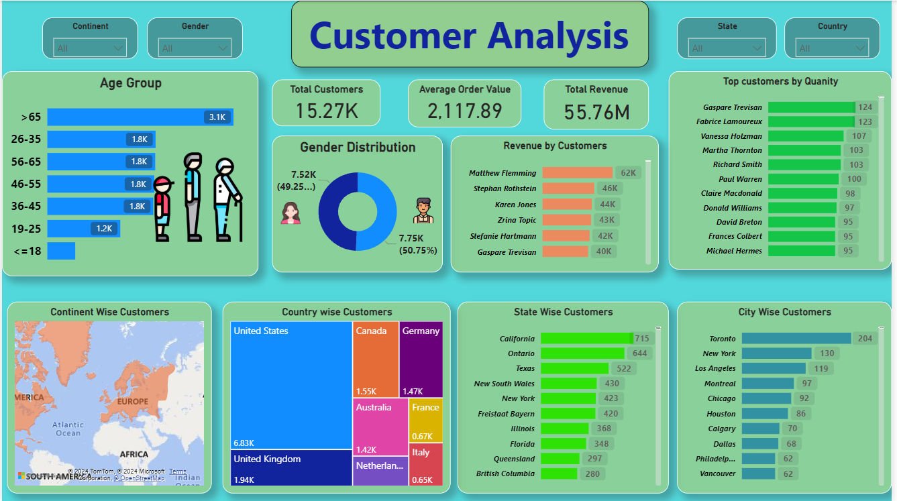
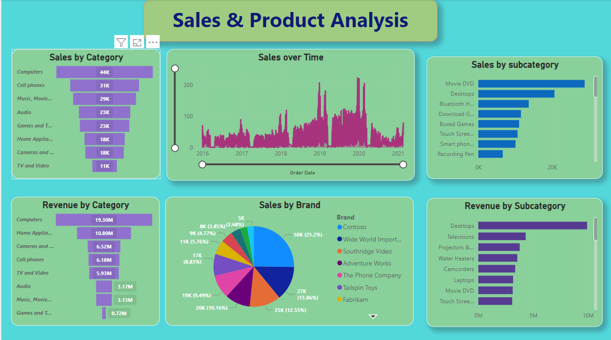
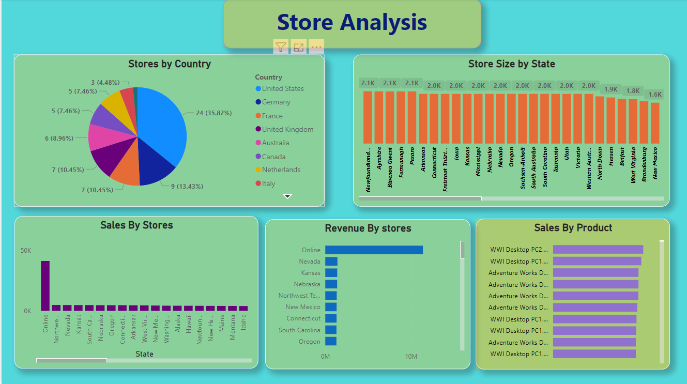

# DataSpark: Illuminating Insights for Global Electronics

### **Project Overview**
DataSpark is a comprehensive data analytics project for Global Electronics, a leading retailer of consumer electronics. This project focuses on uncovering valuable insights through data cleaning, exploration, and visualization to enhance customer satisfaction, optimize business operations, and drive growth. By leveraging Python, SQL, and Power BI/Tableau, the project dives deep into customer demographics, sales trends, product performance, and store analytics.

---

### **Skills Gained**
- **Data Cleaning & Preprocessing:** Handling missing data, transforming data types, merging datasets.
- **Exploratory Data Analysis (EDA):** Identifying trends, patterns, and actionable insights.
- **SQL Proficiency:** Building and querying structured databases for insights.
- **Data Visualization:** Creating intuitive, interactive dashboards with Power BI/Tableau.
- **Domain Knowledge:** Retail analytics with a focus on the electronics industry.

---

### **Problem Statement**
Global Electronics aims to enhance customer satisfaction, optimize operations, and drive overall growth. With data from customers, sales, products, stores, and currency exchange rates, the project addresses business use cases such as:
- Tailoring marketing strategies.
- Optimizing inventory management.
- Forecasting sales trends.
- Informing store expansions and pricing strategies.

---

### **Approach**

1. **Data Cleaning and Preparation**
   - Handled missing values and inconsistent data.
   - Standardized data types (e.g., dates, numerical values).
   - Merged datasets to facilitate holistic analysis.
   
2. **Database Integration**
   - Imported cleaned data into an SQL database.
   - Created tables for key datasets (customers, products, sales, stores, currency rates).
   
3. **Interactive Dashboards**
   - Connected SQL to Power BI/Tableau.
   - Developed visually compelling dashboards to communicate findings.
   
4. **SQL Queries**
   - Formulated 10+ SQL queries to answer critical business questions.

5. **Exploratory Data Analysis**
   - Conducted detailed analysis on customer, sales, product, and store data.
   - Visualized trends, purchasing patterns, and performance metrics.

---

### **Project Deliverables**
1. **Data Cleaning and Preparation**
   - **Notebook:** `Data_Cleaning_and_Preprocessing_EDA.ipynb`
   - Includes preprocessing steps and exploratory insights.

2. **SQL Database**
   - **File:** `global_electronics.sql`
   - Structured database schema and sample queries.

3. **Interactive Dashboards**
   - Visualizations highlighting customer segmentation, sales trends, product performance, and store operations.
   - - 
   - - 
   - - 
4. **Comprehensive Insights**
   - Actionable recommendations for marketing, inventory, and pricing strategies.

---

### **Key Insights**

#### **Customer Analysis**
- **Demographics:** Majority customers aged 26–55, with nearly equal gender distribution.
- **Location Insights:** United States leads in customer base, followed by the UK and Canada.
- **Purchasing Behavior:** Customers aged 35–55 contribute the most revenue.

#### **Sales Analysis**
- **Top Categories:** Computers and cell phones dominate sales.
- **Seasonality:** Sales spikes observed during the holiday seasons.
- **Subcategory Leaders:** Movie DVDs and desktops are top performers.

#### **Product Analysis**
- **Popular Products:** WWI Desktop PCs are top-selling items.
- **Revenue Drivers:** Computers contribute the highest revenue, with significant margins.

#### **Store Analysis**
- **Top Performing Stores:** Online sales outperform physical stores.
- **Geographical Trends:** U.S. stores dominate revenue, with strong performance in California and Texas.

---

### **Visualizations**
Interactive dashboards created with Power BI/Tableau include:
1. **Customer Analysis Dashboard**
   - Age, gender, location, purchasing behavior.
2. **Sales & Product Analysis Dashboard**
   - Sales trends, category performance, revenue contribution.
3. **Store Analysis Dashboard**
   - Store size, location-wise performance, revenue drivers.

---

### **SQL Highlights**
The SQL database enables efficient querying for insights:
- **Customer Segmentation:** Identifying high-value customer groups.
- **Product Performance:** Analyzing top-performing products and categories.
- **Store Operations:** Comparing revenue and sales trends by location and store size.

---

### **Getting Started**

1. Clone this repository:
   ```bash
   git clone https://github.com/yourusername/DataSpark_GlobalElectronics.git
   cd DataSpark_GlobalElectronics

2. Install dependencies:
Python (version 3.8+)
Jupyter Notebook
SQL Server/MySQL for database setup.

3. Run the preprocessing notebook:
      ```bash
          jupyter notebook Data_Cleaning_and_Preprocessing_EDA.ipynb
4. Import SQL schema:
      ```bash
            SOURCE global_electronics.sql;
5. Connect Power BI to the SQL database withh ODBC Connector for dashboards.

## Contributing:

- Contributions are welcome! Feel free to submit **pull requests** or open **issues** for any bugs, feature requests, or improvements.
- Let me know if you need any further changes or assistance!  
